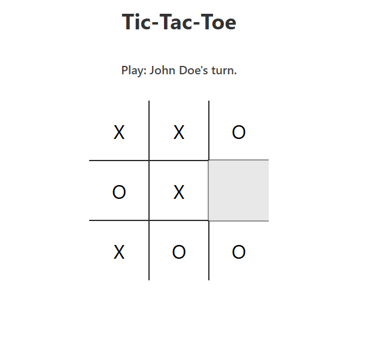
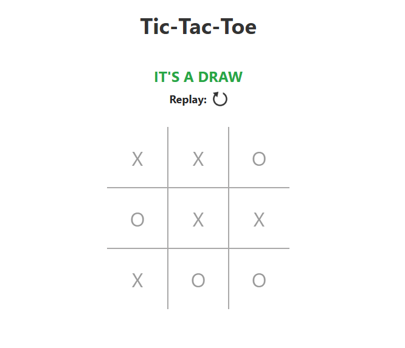

# 🎮 Tic-Tac-Toe

A simple, interactive Tic-Tac-Toe game built with **HTML, CSS, and JavaScript** — completed as part of [The Odin Project](https://www.theodinproject.com/) JavaScript curriculum.

This project demonstrates fundamental JavaScript concepts like factory functions, DOM manipulation, event handling, and game logic encapsulation.

---

## 🔗 Live Preview

👉 [Click here to play the game](https://babashehu01.github.io/tic-tac-toe/)  

---

## 📸 Screenshot

---

## 🛠️ Features

- 2-player gameplay (X and O)
- Win/draw detection logic
- Game eplay
- Form validation for player names
- Responsive and modern UI

---
